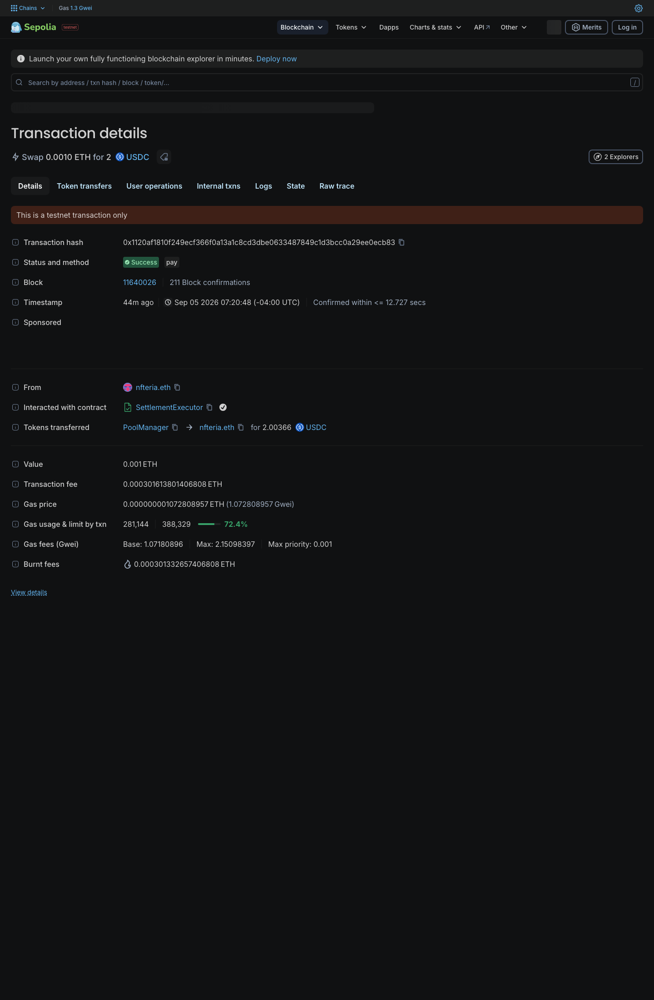
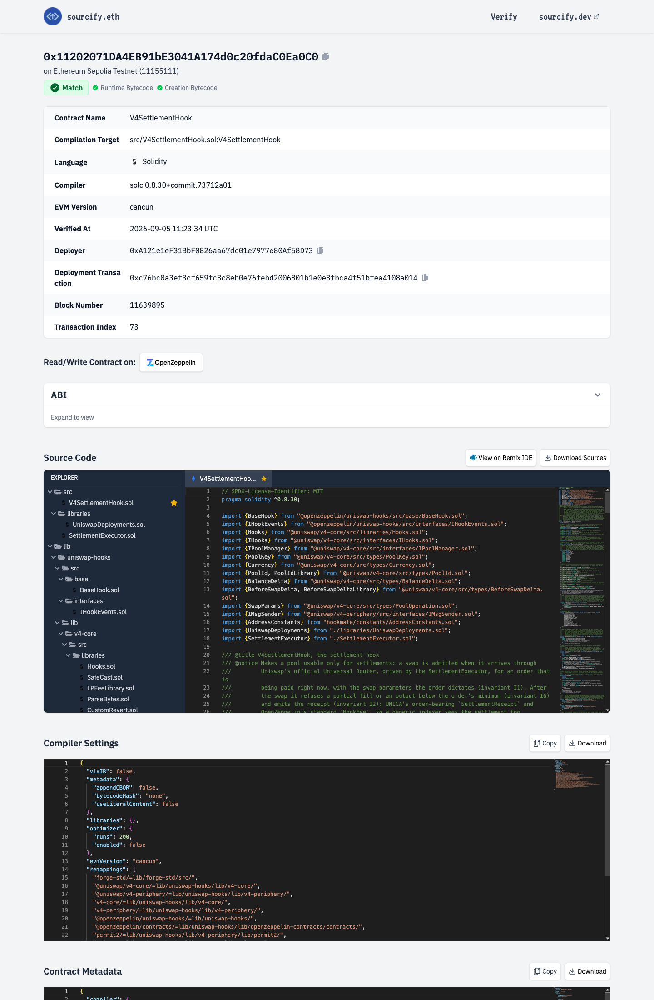
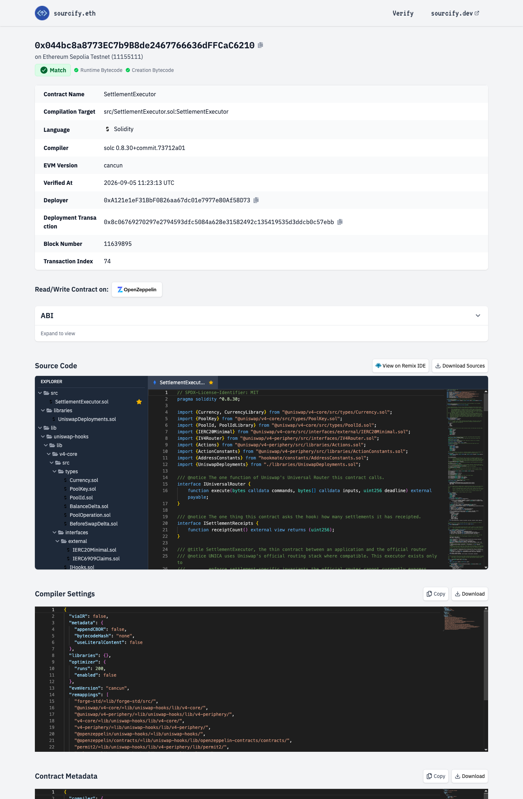
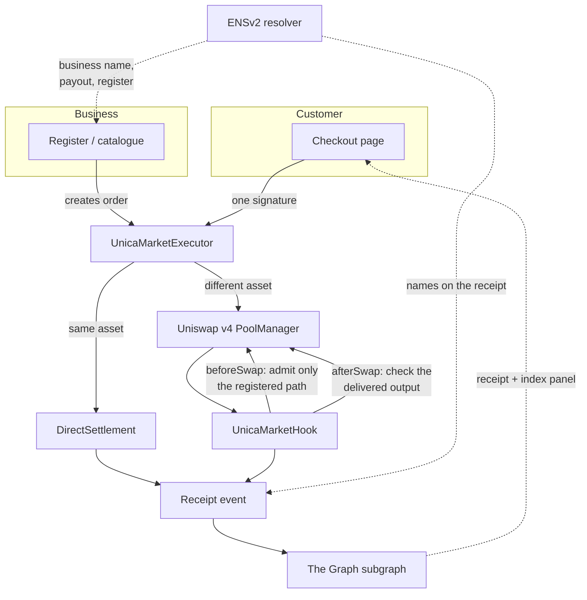

# UNICA

**Accept a payment in the asset a customer holds, and settle it into the asset the business
asked for — in one transaction, with a receipt anyone can check.**

UNICA is a Uniswap v4 hook and executor, ENS-based business identity, and a Graph-indexed
receipt, wired into a working shop front. Before signing, the customer sees what they pay and
what the business receives.

> ### Testnet only · Unaudited · No real money
>
> Every contract here is deployed on public **test** networks. Nothing has been audited. Every
> market on chain carries `demonstrationOnly: true`. Do not put value into this.

[Live app](https://unica.nfteria.click) ·
[Deployments](./deployments/unica-v4/) ·
[Architecture](./docs/ARCHITECTURE.md) ·
[Security](./SECURITY.md) ·
[AI disclosure](./AI_USAGE.md)

---

## Evidence

Captures of public explorer pages. **These document the 2026-09-05 settlement generation**
(`V4SettlementHook` / `SettlementExecutor`), which is not the current v5 market generation —
the full provenance, including which captures are historical, is in
[`docs/proof/README.md`](./docs/proof/README.md). Current v5 addresses are in the
[networks table](#supported-networks) below.

| | | |
|---|---|---|
|  |  |  |
| A settlement transaction | Hook source, verified | Executor source, verified |

Re-prove these from the chain yourself, without trusting this repository:

```bash
bash docs/proof/verify-day1.sh
bash docs/proof/verify-live.sh
```

---

## Sixty seconds

**The business.** Signs in with its wallet. Its name, payout wallet, register and shop link are
read from the chain, not typed into the app. It lists what it sells into an on-chain catalogue,
and hands out a link or a QR code per product. To charge a walk-in customer it rings up an
amount on the register, which prices the sale and produces a payment link.

**The customer.** Opens the link. The checkout names the business, what the customer pays, and
what the business is guaranteed to receive — before any signature. One signature pays it. The
screen then says **Paid** only after the evidence rules verify it on chain, and links a receipt
that anyone can open.

**Two settlement routes.** If the customer is paying in the same asset the business wants, it
settles directly. If not, the payment converts through a Uniswap v4 pool whose hook admits only
that path, for a registered order. Both end in the same receipt.

---

## Architecture



Deeper material lives in [`docs/ARCHITECTURE.md`](./docs/ARCHITECTURE.md),
[`docs/RECEIPT-SCHEMA.md`](./docs/RECEIPT-SCHEMA.md) and
[`docs/INVARIANTS.md`](./docs/INVARIANTS.md).

---

## Uniswap v4

The hook is the thing that makes a payment pool different from a trading pool.

`UnicaMarketHook` runs inside Uniswap's PoolManager and decides whether a swap on its pool is a
settlement at all. It admits a swap only when the caller is the registered executor, only in the
one configured direction, and only against an order the executor already holds — the payer
supplies an order id, never the terms. `beforeSwap` refuses anything else. `afterSwap` checks
what was actually delivered against what the order promised, so a short fill reverts the whole
transaction rather than paying the business less than it was told.

That matters because the alternative is worse than it looks: under exact-output routing the
official periphery checks the input ceiling and does not compare delivered output with the
request. Full-fill enforcement therefore lives in a hook or it lives nowhere.

- Hook: [`src/unica-v4/UnicaMarketHook.sol`](./src/unica-v4/UnicaMarketHook.sol)
- Executor: [`src/unica-v4/UnicaMarketExecutor.sol`](./src/unica-v4/UnicaMarketExecutor.sol)
- Registry and caps: [`src/unica-v4/UnicaMarketRegistry.sol`](./src/unica-v4/UnicaMarketRegistry.sol)
- Direct route, no pool: [`src/unica-v5/DirectSettlement.sol`](./src/unica-v5/DirectSettlement.sol)

**Direct settlement and conversion are separate routes and are kept separate in this document.**
A same-asset sale never touches a pool. Only a different-asset sale converts.

## ENS

Business identity is read from the chain, not held in the app. A business resolves to a name
under `unica.eth` on Sepolia (`freshcuts.unica.eth` is the live one), and the app reads its
payout wallet, its register lineage and its shop label from the ENSv2 permissioned resolver
through `EnsV2ResolverAuthority`. The customer's own name on the checkout and on the receipt is
resolved the same way. Nothing on those screens is hard-coded UI text — with no chain answer the
screens say so rather than inventing a name.

- Authority: [`src/identity/EnsV2ResolverAuthority.sol`](./src/identity/EnsV2ResolverAuthority.sol)
- Register admission: [`src/identity/TerminalAdmission.sol`](./src/identity/TerminalAdmission.sol)

**Limit:** the Sepolia identity adapter is read-only over the real ENSv2 resolver. A new
business's records are written by the `unica.eth` owner; self-serve sign-up runs on the local
practice chain only.

## The Graph

The subgraph indexes three events into two entities, and the product reads them back.

| Source | Event | Entity |
|---|---|---|
| `UnicaMarketHook` | `SettlementReceipt` | `Settlement` |
| `DirectSettlement` | `DirectReceipt` | `Settlement` |
| `ProductCatalog` | `ProductSold` | `ProductSale` |

The receipt screen queries `settlements(where: {transactionHash})` for a paid transaction and
`productSale(id)` for a catalogue sale — see
[`apps/web/assets/storefront.js`](./apps/web/assets/storefront.js) (`graphQueryFor`) and
[`apps/web/assets/receipt.js`](./apps/web/assets/receipt.js). The receipt's index panel is what
consumes them; it states plainly when a receipt is not yet indexed rather than implying it is
unpaid.

Manifest: [`integrations/graph/subgraph.yaml`](./integrations/graph/subgraph.yaml).
**Sepolia only** — the other four networks are not indexed.

---

## Demonstrated vs deployed

| Capability | Status |
|---|---|
| Direct USDC purchase on Ethereum Sepolia | **Demonstrated end to end** — the submitted 2 USDC product checkout: tx [`0xc0591b3bad038e249453ca9aab7ac6a2770ee101f064f53c49b6b966cc69e4c9`](https://sepolia.etherscan.io/tx/0xc0591b3bad038e249453ca9aab7ac6a2770ee101f064f53c49b6b966cc69e4c9). **This was a direct USDC payment and did not touch a Uniswap pool.** |
| WETH → USDC conversion through the v4 hook | **Demonstrated end to end** — by a **separate register transaction**, not by the product checkout above: tx [`0x4e1a7c61121c39bebbf7f649bc1e7e555fcd382a1c432c471b71d9f6221e5378`](https://sepolia.etherscan.io/tx/0x4e1a7c61121c39bebbf7f649bc1e7e555fcd382a1c432c471b71d9f6221e5378) — status 1 in block 11696159, WETH in and USDC out, with Uniswap's PoolManager and `UnicaMarketHook` both in the transaction logs |
| ENS business and customer identity | **Demonstrated** — `freshcuts.unica.eth` on Sepolia |
| Graph-indexed receipt | **Demonstrated** — subgraph `v5-sepolia-0.2.0`, Sepolia only |
| Hook + executor on five test networks | **Deployed and source-verified** |
| Catalogue, direct settlement, ENS identity beyond Sepolia | **Not deployed** |
| Oracle price policy | **Configured, not enforced** — every live market is `demonstrationOnly` |
| Identity token source verification | **Not verified** — Vyper 0.4.3; the explorer's Vyper form is a manual step |
| Production readiness | **No** — testnet only, unaudited |

---

## Supported networks

Hook and executor are deployed and source-verified on all five. The complete product — catalogue,
direct settlement and ENS identity — runs on **Ethereum Sepolia only**. Every value below is read
from the manifest beside it.

| Network | Chain id | Hook | Executor | Full product stack | Manifest |
|---|---|---|---|---|---|
| Ethereum Sepolia | 11155111 | `0x2570a593…A0c0` | `0x36DD3d5d…8ede` | yes | [manifest](./deployments/unica-v4/11155111.json) |
| Base Sepolia | 84532 | `0x77D1f8d2…a0c0` | `0x89BBdF30…56F9` | no | [manifest](./deployments/unica-v4/84532.json) |
| Arbitrum Sepolia | 421614 | `0x524B0B6A…60c0` | `0x79552Ad8…4879` | no | [manifest](./deployments/unica-v4/421614.json) |
| Unichain Sepolia | 1301 | `0xA112930b…A0c0` | `0xD3730094…9e67` | no | [manifest](./deployments/unica-v4/1301.json) |
| Robinhood Chain testnet | 46630 | `0x30396Bf4…A0c0` | `0xc84f4a8C…aF9a` | no | [manifest](./deployments/unica-v4/46630.json) |

---

## Quick start

**Prerequisites**

| Tool | Version | Why |
|---|---|---|
| Foundry | `v1.5.1` | contracts, tests, scripts |
| Node.js | `>=20.11` (`.nvmrc` pins 22) | web app, indexer, tooling |
| npm | `>=10` | workspaces |
| Vyper *(optional)* | `0.4.3` | the `vy/` art layer only |
| Moccasin *(optional)* | `0.4.4` | the `vy/` test runner only |

```bash
git clone --recurse-submodules https://github.com/NFTeria/UNICA.git
cd UNICA
cp .env.example .env      # names only — never a value
make deps                 # pinned Foundry submodules
npm ci                    # the workspace application tree
```

Nothing above signs, broadcasts, or needs a key. `.env` holds a keystore *name* and a public
address; no private key belongs in it, ever.

## Tests

```bash
# Contracts — build, tests, fmt-check, secret scans, ledger and offline proofs
make gate

# Web application and shared packages — format, typecheck, build, tests
npm run check

# Web tests alone
node --test apps/web/tests/*.test.mjs

# Subgraph (Matchstick) — needs its own install first
cd integrations/graph && npm install && npm test

# Repository guards, individually
bash script/scan.sh                    # secrets
bash script/no-copied-source.sh        # vendored-source provenance
node scripts/verify-public-build.mjs   # the published surface
```

`make gate` deliberately excludes the fork suites: they need a third party's archive node, and a
gate that depends on somebody else's uptime is a status page. Run those with `make fork`.

Counts are not quoted here on purpose — run the commands and read the totals they print.

---

## Repository map

```text
├── src/                  Solidity
│   ├── unica-v4/         market hook, executor, registry  (current generation)
│   ├── unica-v5/         product catalogue, direct settlement
│   └── identity/         ENSv2 authority, register admission
├── apps/web/             the shop, checkout and receipt (no framework, no bundler)
├── integrations/graph/   the subgraph: manifest, schema, handlers, Matchstick tests
├── test/                 Foundry suites, including attack/ and fork/
├── script/               deploy, verify, proof and guard scripts
├── tools/                receipt verifier, signing tool, POS CLI, evidence
├── deployments/          per-network manifests — addresses, code hashes, verification
├── broadcast/            deployment records, kept as evidence
├── docs/                 architecture, deployment, threat model, proof captures
└── vy/                   Vyper art and identity-token layer
```

---

## Security model and limitations

Read [`SECURITY.md`](./SECURITY.md) first — it carries the trust boundary, the disclosure
process, and an open Critical finding against the frozen, undeployed V2 core.

What is trusted, and not audited here: Uniswap's PoolManager, the Universal Router, and Permit2.
What is ours: the hook and the executor.

Known limitations:

- **Unaudited, testnet only.** No third-party review has been done.
- **Every live market is `demonstrationOnly`.** The oracle price policy is configured but not
  enforced on chain.
- **The subgraph indexes Sepolia only.** A receipt on the other four networks is not indexed.
- **Business sign-up is not self-serve on Sepolia.** Records are written by the `unica.eth` owner.
- **The identity token is not source-verified** on the explorer.
- **V2 is frozen and must not be deployed** — see [`SECURITY.md`](./SECURITY.md).

---

## Contributing, licence and disclosure

- [`CONTRIBUTING.md`](./CONTRIBUTING.md) — how to build it, and the three rules that cannot be
  undone after a push.
- [`SECURITY.md`](./SECURITY.md) — trust boundary and responsible disclosure. There is no bounty.
- [`AI_USAGE.md`](./AI_USAGE.md) — which AI tools assisted, and the specific files each touched.
  Authorship and tooling are disclosed separately and both statements hold at once.
- [`LICENSE`](./LICENSE) — MIT.

Built by **NFTeria**. UNICA is independent: it is not commissioned by, affiliated with, endorsed
by, or reviewed by Uniswap, ENS, The Graph, or anyone else named here.
