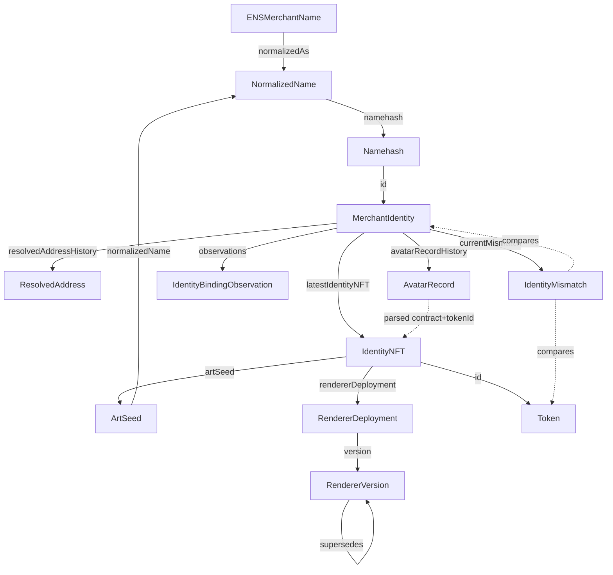

# UNICA v5 — ENS merchant identity and renderer provenance graph

Draft for owner review. Nothing here is committed, deployed, or published; it authorizes no
account, no infrastructure spend, no subgraph deployment, no ENS record write, and no NFT mint.
This document designs an indexed read layer over ENS-derived merchant identity and the planned
on-chain art layer described in `docs/unica-v4/ENS-ART-LAYER.md`. It never supplies settlement
truth or identity truth: contracts and ENS itself remain the source of truth, and an indexing
failure must never create, authorize, or settle a payment, or be read as proof that a name owns a
payout address.

Track: this is UNICA's **from-scratch** entry (owner ruling, 2026-09-11). Earlier drafts said
"Continuity"; that was wrong and is not repeated here. No sponsor-channel transcript was supplied
for this work; nothing below reports, summarizes, or attributes an idea to that discussion. Every
claim below is labelled VERIFIED (with source), PROPOSED (UNICA design), or UNKNOWN.

**Stated once, binding everywhere below:** an identity NFT never authorizes settlement and never
replaces address verification. Every place this document could be read as implying otherwise
restates it. See §8 for the full list of restatements.

## 0. Status and scope

- **Status: design only.** No contract in this document's scope exists. `docs/unica-v4/ENS-ART-LAYER.md`
  §1 states the art layer (namemath, logobackground, svgrender, the ERC-721 art token) is "planned,
  not implemented," with a start condition (v4 specification committed) and a cut condition (first
  stream cut under deadline pressure). This graph design inherits both conditions: it indexes a
  contract surface that is **SPECIFIED-NOT-BUILT** (§2), and it must not be read as implying that
  surface ships.
- **Scope: one stream of the UNICA v5 read layer.** A sibling document,
  `docs/unica-v5/graph/SETTLEMENT-SCHEMA.md`, designs the indexed evidence graph over settlement
  receipts (V1/V3 live, V2 frozen, UNICA v4 specified). This document is scoped to ENS merchant
  identity and renderer provenance only — the art layer's own boundary rule (H3, restated §8) means
  these are, and stay, separate concerns. Where the two graphs need to be joined (§4.10), the join
  is named explicitly rather than merged into one schema.
- **No re-derivation of what the calling context already established.** The "WHAT EXISTS TODAY"
  facts about `integrations/graph/`, `integrations/graph-v2/`, the frozen receipt schema, and the
  v4 event surface being SPECIFIED-NOT-BUILT are taken as given (§3) and are not re-verified here.
- **Out of scope:** the UNICA v5 dashboard's UI, any subgraph deployment or Studio account, any ENS
  record write, any NFT mint, and any claim about which prize track this stream is eligible for
  (§10 — that determination requires a written answer from an identifiable Graph team member and is
  not made here).

## 1. Sources and their status

| # | Source | Author / org | Kind | Retrieved | Used for | Conflicts |
| --- | --- | --- | --- | --- | --- | --- |
| S1 | `docs.ens.domains/ensip/12` | ENS | OFFICIAL | 2026-09-11 | Avatar NFT URI format (CAIP-22/CAIP-29), the four-step client resolution procedure, the SHOULD-level ownership-verification rule | None found; matches `docs/unica-v4/ENS-ART-LAYER.md` §4.1–4.2's prior citation of the same ENSIP (retrieved there 2026-09-11) |
| S2 | `docs.ens.domains/ensip/15` | ENS | OFFICIAL | 2026-09-11 | ENS name normalization: status Final, purpose (spoofing/confusable/homograph resistance), and that normalization is deterministic and idempotent, so a normalized name is a valid lookup key | See §4.1 and §9 — this repository's own normalizer (`web/ensv2/resolve.mjs`) is a **conservative ASCII-only approximation**, not a full ENSIP-15 implementation; that gap was already flagged UNKNOWN in `docs/unica-v4/ENS-ART-LAYER.md` §3.4 and is carried forward, not resolved, here |
| S3 | `eips.ethereum.org/EIPS/eip-721` | Ethereum EIPs | OFFICIAL | 2026-09-11 | `tokenURI()` contract, the ERC-721 Metadata JSON Schema (`name`, `description`, `image`), and that the standard explicitly permits a mutable `tokenURI` and mandates no on-chain storage format | None. Confirms `docs/unica-v4/ENS-ART-LAYER.md` §3.2's own reading that the base64-JSON wrapping pattern is convention, not EIP-721 requirement |
| S4 | `docs.ens.domains/ensv2/permissioned-resolver` | ENS | OFFICIAL | 2026-09-11 | The Permissioned Resolver's full event list: `AddrChanged`, `AddressChanged`, `TextChanged`, `DataChanged`, `ContenthashChanged`, `NameChanged`, `PubkeyChanged`, `ABIChanged`, `InterfaceChanged`, `VersionChanged`, `AliasChanged`, plus the EAC naming events `NamedResource`/`NamedTextResource`/`NamedDataResource`/`NamedAddrResource` | None found against `integrations/ensv2/permissioned.mjs` and `README.md`, which cite the same page (retrieved there 2026-09-08) for EAC signatures only, not this event list — this document is the first place in the repository that records the record-change event names |
| S5 | `raw.githubusercontent.com/ChainAgnostic/CAIPs/main/CAIPs/caip-22.md` | Chain Agnostic Standards Alliance | OFFICIAL (for that standard) | 2026-09-11 | The `erc721` asset-reference format: the contract address "in the current chain_id" under the `eip155` namespace — a chain-**scoped** reference (one chain id per reference), with the chain id itself unrestricted (not pinned to mainnet) | None; consistent with `docs/unica-v4/ENS-ART-LAYER.md` §4.1's reading, restated precisely in §4.4 below to avoid that document's looser "chain-agnostic" phrasing |
| S6 | `github.com/graphprotocol/ens-subgraph` (`schema.graphql`, `subgraph.yaml`) | The Graph / ENS (official example, ENS's own subgraph mirrored at graphprotocol) | OFFICIAL EXAMPLE | 2026-09-11 | The `Domain` entity (id = namehash), the `Resolver` entity (id = resolver address concatenated with namehash), the per-event-type entity pattern (`AddrChanged`, `NameChanged`, `AbiChanged`, `PubkeyChanged`, `ContenthashChanged`, `InterfaceChanged`, `AuthorisationChanged`, each id = block number concatenated with log id, linked back to `Resolver` by a stored field), and that resolvers are indexed through a dynamic data source instantiated when a `NewResolver` event names one | None. This is the direct precedent §5 and §6 below are modelled on — an official Graph example indexing exactly the kind of "current value plus full change history" shape this document needs for resolved addresses |
| S7 | `thegraph.com/docs/en/subgraphs/developing/creating/ql-schema/` | The Graph | OFFICIAL | 2026-09-11 | Exact wording: entities are mutable by default; `@entity(immutable: true)` is for "entity types that will never be modified, such as those containing data extracted verbatim from the chain"; immutable entities "are much faster to write and to query"; `@derivedFrom` is a virtual, read-only reverse lookup, better for both indexing and query performance when only one side is stored; `Bytes!` is the recommended id type unless the id is human-readable text; `left.id.concat(right.id)` and `left.id.concatI32(count)` are the standard concatenation idioms | None; matches the id pattern already used by this repository's own `integrations/graph/src/mapping.ts` (`transaction.hash.concatI32(logIndex)`) and `integrations/graph-v2/README.md` (`keccak256(network) ++ executor ++ transactionHash ++ logIndex`) |
| S8 | `thegraph.com/docs/en/subgraphs/developing/creating/subgraph-manifest/` | The Graph | OFFICIAL | 2026-09-11 | `templates:` is a manifest section distinct from `dataSources:`; a template "lacks a pre-defined contract address"; a mapping instantiates one at a discovered address with `TemplateName.create(address)`, or `TemplateName.createWithContext(address, context)` to pass extra data | None; matches `docs/unica-v4/EVENT-SCHEMA.md` §10.2's own proposed use of templates (`UnicaMarketHook`, `UnicaMarketExecutor` instantiated from the registry's `MarketProposed` handler) |
| S9 | `thegraph.com/docs/en/subgraphs/developing/creating/starting-your-subgraph/` | The Graph | OFFICIAL | 2026-09-11 | Confirms the manifest/schema/mapping three-part structure; a landing page, low information yield beyond that | — |
| — | `thegraph.com/docs/en/subgraphs/best-practices/immutable-entities-bytes-as-ids/` | The Graph | OFFICIAL | attempted 2026-09-11 | — | **UNREAD.** Two redirects from two different starting URLs (`.../cookbook/immutable-entities-bytes-as-ids` → `.../cookbook/immutable-entities-bytes-as-ids/` → `.../subgraphs/best-practices/immutable-entities-bytes-as-ids/`) and the final target was not fetched after the retry. Nothing below is sourced to this page; S7, fetched directly, already carries the same guidance and is cited instead |
| — | `github.com/ensdomains/resolvers` (`PublicResolver.sol` family) | ENS | OFFICIAL (repository), retrieved via search snippet, not a direct file fetch | attempted 2026-09-11 | — | The exact Solidity signatures `AddrChanged(bytes32 indexed node, address a)`, `AddressChanged(bytes32 indexed node, uint256 coinType, bytes newAddress)`, `TextChanged(bytes32 indexed node, string indexed indexedKey, string key)` surfaced this way; **not independently re-verified against the file** in this pass, so treated as corroborating S4 and S6 rather than as a primary citation on its own. A subgraph implementation must re-derive these from the compiled ABI of the actual ENSv2 Permissioned Resolver, per this repository's own standing rule that no selector or signature is ever hand-typed (`integrations/ensv2/permissioned.mjs`, repo file, read 2026-09-11) |

Repository files read for this document (not URLs, dated by their own "read" convention):
`docs/unica-v4/ENS-ART-LAYER.md`, `docs/unica-v4/DECISIONS.md` ("ENS art layer", H1–H12),
`docs/unica-v4/EVENT-SCHEMA.md`, `docs/v2/SECURITY-ADVISORY-001.md`, `integrations/ensv2/README.md`,
`integrations/ensv2/identity.mjs`, `integrations/ensv2/records.mjs`, `integrations/ensv2/merchant-config.mjs`,
`integrations/ensv2/permissioned.mjs`, `web/ensv2/resolve.mjs`, `integrations/graph/schema.graphql`,
`integrations/graph/src/mapping.ts`, `integrations/graph-v2/schema.graphql`, `integrations/graph-v2/README.md`,
`vy/src/logobackground.vy`, `vy/src/namemath.vy` (listed, not opened beyond the wordcount — its
seed function is not the load-bearing citation here), all read 2026-09-11. Sibling drafts
`docs/unica-v5/graph/SETTLEMENT-SCHEMA.md`, `NETWORK-OPTIONS.md`, `MENTOR-QUESTIONS.md` were read to
keep vocabulary consistent and avoid duplicating their content; where this document depends on a
claim only they carry (e.g. which chains The Graph supports), it points there rather than repeating
an unverified copy.

## 2. Vocabulary: BUILT vs SPECIFIED-NOT-BUILT, and the identity/settlement boundary

Following `docs/unica-v5/graph/SETTLEMENT-SCHEMA.md`'s own vocabulary, so the two documents read as
one system rather than two dialects:

- **BUILT** — code exists in this repository today and can be read directly. The ENSv2 resolution
  chain (`web/ensv2/resolve.mjs`, `integrations/ensv2/*`) is BUILT. The legacy `vy/src/namemath.vy`
  and `vy/src/logobackground.vy` are BUILT, but are explicitly legacy provenance copies (H10) that
  the new renderer does not import.
- **SPECIFIED-NOT-BUILT** — described in a specification document, with no contract or deployed
  code yet. The entire art layer (`namemath_v2`, `logobackground_v2`, `svgrender`, the ERC-721 art
  token) is SPECIFIED-NOT-BUILT, per `docs/unica-v4/ENS-ART-LAYER.md` §1's own status line. Every
  entity in §5 below that reads from that layer is marked SPECIFIED-NOT-BUILT and cites the plan
  section it comes from; none is presented as something a contract emits today.
- **The identity/settlement boundary, restated for this layer.** UNICA v4's rule that "settlement
  correctness NEVER depends on an indexer" (task boundary) has an identity-layer analogue stated in
  `docs/unica-v4/ENS-ART-LAYER.md` H3 and H11: the art and math modules stay outside the settlement
  path, and "the image alone is never proof" of payout identity. This document's entities never
  feed a payment decision; they feed a read surface a checkout or dashboard displays *beside* an
  independently performed ENS resolution (§4.5–4.6), never *instead of* one.
- **Two different "current" concepts, and neither is settlement truth.** `SettlementMerchant`
  (§5) tracks what an off-chain preflight run (`integrations/ensv2/merchant-config.mjs`) currently
  believes a name's payout configuration is; `Token`/`IdentityNFT` (§5) track what an ERC-721
  contract currently records. Both are read models over data this repository already treats as
  advisory rather than authoritative outside a live re-check — see `merchant-config.mjs`'s own
  `PREFLIGHT_STATUS.ACCEPTED` result, which is a judgement over one evidence bundle at one block,
  never a standing fact.

## 3. What exists today (read, not re-derived)

Given by the calling context and not re-verified in this pass:

- `integrations/graph/` — one live-shape subgraph (specVersion 1.0.0, apiVersion 0.0.9, network
  `sepolia`), two data sources on the `V4SettlementHook` ABI (V1 hook
  `0x11202071DA4EB91bE3041A174d0c20fdaC0Ea0C0` from block 11639895, V3 hook
  `0x5d6AdF56facB123A2e46D36EA7034cb393D6A0c0` from block 11667702), one handler
  (`handleSettlementReceipt`), one entity (`Settlement @entity(immutable: true)`, 17 scalar fields,
  no relations). This document does not touch it and proposes no change to it.
- `integrations/graph-v2/` — a separate manifest and schema (`InvoiceSettlement`, `Deployment`) for
  the V2 `QuoteSettlementExecutor`, not deployed to any public chain. `Deployment` is the one entity
  in either existing subgraph with a `@derivedFrom` relation — the same relation kind §5 below uses
  for `MerchantIdentity.observations` and `RendererDeployment.tokens`.
- Neither existing subgraph is deployed to Subgraph Studio or the decentralized network, and no
  Studio account or query-fee payment method exists for either (repository record).
- **UNICA v4 contracts do not exist yet.** The v4 event surface (12 events across 3 emitting
  contracts) is specified only, in `docs/unica-v4/EVENT-SCHEMA.md` and
  `docs/unica-v4/SPEC-CONTRACTS.md`. That schema's own §10.2 proposes a separate settlement subgraph
  under `integrations/graph/unica-v4/`, with `Market`, `Order`, `Settlement`, and change-history
  entities keyed by transaction hash plus log index — the exact pattern this document reuses for
  ENS record-change history (§5, §6).
- **ENSv2 identity, resolution, and authorization are BUILT and live-tested against Sepolia**,
  through `web/ensv2/resolve.mjs` (name normalization — conservative ASCII subset, `dnsEncode`,
  `namehash` per ENSIP-1, `resolveMerchant`), `integrations/ensv2/permissioned.mjs` (Enhanced Access
  Control reads), `integrations/ensv2/merchant-config.mjs` (the `pay`/`treasury`/`agent` text-record
  chain, the four-scope authority read, and `bindConfiguration`'s positional commitment), and
  `integrations/ensv2/records.mjs` (the strict positional text-record encoding). None of this is
  indexed by a subgraph today; every read is a live `eth_call` through an injected reader.
- **The art layer is SPECIFIED-NOT-BUILT.** `docs/unica-v4/ENS-ART-LAYER.md` (H1–H12,
  `docs/unica-v4/DECISIONS.md` "ENS art layer") plans namemath, logobackground, svgrender, and an
  ERC-721 art token whose `tokenURI` embeds an on-chain SVG, with the ENS `avatar` record pointing
  at it. No file exists under `vy/src/art/` or `vy/src/math/` (the plan's own §1). The plan's own
  §3.4 leaves ENSIP-15 normalization **UNKNOWN**, unverified as of 2026-09-11 — this document
  inherits that gap rather than resolving it (§9).

## 4. Design questions answered

### 4.1 How the normalized name binds to deterministic art

`docs/unica-v4/ENS-ART-LAYER.md` §3.3 states the determinism rule directly: `output =
f(normalized_ens_name, renderer_version)`, never a function of mutable data such as a payout
address. The legacy `vy/src/logobackground.vy` (repo file, read 2026-09-11) shows the concrete
mechanism this model is built from: `_seed(name) -> keccak256(name)` is a `@pure` function taking a
`String[64]` — no storage read, no external call, no dependency on anything but the bytes of the
name itself. `vy/src/namemath.vy` (233 lines, not read in full for this pass, listed for
completeness) is described the same way in `docs/unica-v4/ENS-ART-LAYER.md` §3.2: "self-contained
with no imports," modelling "seeded planar polynomial automorphisms with a small on-chain seed
registry." Both together give the mechanism this graph's `ArtSeed` entity (§5) is a read model of:
a pure hash of the normalized name is the only input to every downstream coordinate, palette, and
cell colour.

**What "normalized" means here is the open half of this answer.** ENSIP-15 (S2) is Final and
defines a canonical, deterministic normalization suitable as a hashing input. But
`docs/unica-v4/ENS-ART-LAYER.md` §3.4 already records, and this document does not resolve, that
this repository's actual normalizer (`web/ensv2/resolve.mjs`'s `normalizeName`) is a **conservative
ASCII-only subset**: it lower-cases, checks label length and hyphen placement, and outright refuses
any non-ASCII input rather than attempting full ENSIP-15 confusable detection. That is a
deliberate, documented choice ("a name we cannot normalise correctly is a name we do not resolve" —
`web/ensv2/resolve.mjs` comment, repo file, read 2026-09-11), not an oversight, but it means: **for
any name accepted by this repository today, the ASCII-conservative form and the full ENSIP-15 form
happen to coincide** (both reduce to the same lower-case ASCII string for a pure-ASCII label), while
a name ENSIP-15 would accept and this repository would refuse (any label with non-ASCII characters)
never reaches the art layer at all. So the binding is safe by refusal rather than by having
implemented the full standard — a distinction PROPOSED here to be stated explicitly in the eventual
art-layer implementation, not left implicit.

- **PROPOSED — the exact string fed to `ArtSeed`.** `vy/src/logobackground.vy`'s `seed()` takes the
  human-readable name string (bounded `String[64]`), not the 32-byte namehash. Whether the new
  versioned module keeps that choice, or seeds from the namehash instead, is **not specified** by
  `docs/unica-v4/ENS-ART-LAYER.md` (§3.3 says only "normalized_ens_name," not which encoding of it).
  This matters for the schema: if the seed is over the string, `ArtSeed.sourceString` is the field
  of record and a length bound becomes a real constraint for `merchant.parent` names longer than 64
  bytes; if over the namehash, `ArtSeed.sourceNamehash` is, and the constraint disappears. Recorded
  as an open question in §9 rather than guessed.

### 4.2 How a renderer version preserves "same name plus same version gives the same art"

`docs/unica-v4/ENS-ART-LAYER.md` H6 states the rule in full: "the same normalized name and renderer
version produce the same art forever... a renderer change is a new renderer_version, never a
mutation of prior output." Two structural facts already established elsewhere in this repository
make that enforceable rather than aspirational, and this graph's `RendererVersion` and
`RendererDeployment` entities (§5) are read models of exactly these two facts:

1. **Non-upgradeability by construction, not by promise.** `docs/unica-v4/EVENT-SCHEMA.md` §12
   states the same discipline for the settlement hook and executor: "never upgradeable... a changed
   event is new code with a new `HOOK_CREATION_CODE_HASH`, which the deployed factory refuses, so it
   ships as a new factory, release and manifest." `docs/unica-v4/ENS-ART-LAYER.md` H10 applies the
   identical shape to the art layer: the legacy files "stay unchanged for provenance," and "the new
   renderer imports only the new versioned implementation," never the old one, with a version bump
   living in a new file path (H7's descriptive-naming rule). Taken together, PROPOSED: **a renderer
   version is not a mutable field on a shared contract — it is a separate contract deployment**, and
   `RendererDeployment` (§5) is keyed by `(chainId, contractAddress)` rather than by a version
   integer alone, so "which bytecode actually ran" is never inferred, only recorded from a real
   deployment.
2. **A pure function of immutable inputs.** Because `ArtSeed` is `keccak256(normalizedName)` and a
   `RendererDeployment`'s code is fixed at deployment (point 1), the pair `(ArtSeed, rendererVersion)`
   determines the SVG output as a mathematical fact, not a promise the indexer enforces. The
   subgraph's job is narrower and honest about it: it records which `(seed, rendererDeployment)`
   pairs were actually minted (`IdentityNFT`, §5) and exposes each mint's `tokenURI` value
   immutably, so a reader can verify H6 by comparing two `IdentityNFT` rows rather than trusting a
   claim that they match.

### 4.3 How every historical renderer version is exposed

`docs/unica-v4/ENS-ART-LAYER.md` H10 requires the Sept 8 legacy copies to "stay unchanged for
provenance" and every future version to live "beside them in versioned descriptive paths." This
graph's answer, PROPOSED:

- `RendererVersion` is a small, append-only catalogue entity — one row per version identifier ever
  shipped, immutable once written, holding the version's own descriptive label (H7) and a pointer to
  the `RendererDeployment` that carries its actual bytecode.
- `RendererDeployment` is one row per `(chainId, contractAddress)` a renderer version was actually
  deployed to, immutable, holding the deployment block, deployer address, and (when the deployment
  read succeeds) the runtime code hash — mirroring `docs/unica-v4/EVENT-SCHEMA.md`'s own "pinned by
  runtime code hash" discipline for the Chainlink feed adapter (§7) and `integrations/ensv2/profile.mjs`'s
  practice of verifying a contract by re-reading its code rather than trusting an address alone.
- Both are `@entity(immutable: true)` (S7): once a version ships and is deployed, that row never
  changes — a new version is a new row, never an edit, which is the schema-level enforcement of H6's
  "never a mutation of prior output."
- A query for "every historical renderer version" is then `RendererVersion.orderBy: shippedAtBlock`,
  each joined to its `RendererDeployment` — nothing is ever deleted or superseded in place, so the
  full history is always the full result set, with no separate "archive" table to fall out of sync
  with a "current" one.

### 4.4 How an ENSIP-12 avatar NFT reference is indexed

ENSIP-12 (S1, Final, 2022-01-18) fixes both the wire format and the client procedure this graph
must be able to reconstruct without executing untrusted code:

- **Format.** The `avatar` text record's value, for an NFT reference, follows CAIP-22 (ERC-721) or
  CAIP-29 (ERC-1155): `eip155:<chainId>/erc721:<contractAddress>/<tokenId>`. CAIP-22 (S5) defines the
  asset reference as the contract address "in the current chain_id" — a **chain-scoped** identifier
  (exactly one chain id per reference), and that chain id is not restricted to mainnet; ENSIP-12's
  own worked example happens to use `eip155:1`, which S1 and `docs/unica-v4/ENS-ART-LAYER.md` §4.1
  both read as an example, not a restriction. For UNICA's first implementation (H5, Sepolia only),
  the value is `eip155:11155111/erc721:<art_token_address>/<tokenId>`.
- **Client procedure (S1).** Retrieve the token's `tokenURI`; resolve it and fetch the ERC-721/1155
  metadata; extract `image`; resolve and display that. A client SHOULD additionally re-resolve the
  name's own address (or use the reverse-resolved address) and verify that address owns the
  referenced token; on a mismatch it MUST treat the avatar URI as invalid.
- **PROPOSED indexing design.** `AvatarRecord` (§5) is an immutable, append-only entity — one row
  per observed `TextChanged`/`AddressChanged`-family event on the `avatar` key of a name's resolver
  (S4 confirms the Permissioned Resolver emits `TextChanged(node, indexedKey, key, value)` for
  exactly this), holding the raw CAIP-22/29 string as published. A mapping-time parse (regex over
  the fixed grammar, not a network call — subgraph mappings cannot make outbound HTTP or RPC calls
  during indexing) extracts `chainId`, `contractAddress`, `tokenId` into typed fields on the same
  row when the string matches the grammar, and records `parseStatus: MALFORMED` without those fields
  when it does not — never silently dropping a record that fails to parse, consistent with §7's
  anomaly rule.
- **What the subgraph cannot do, stated rather than hidden.** It cannot itself perform the
  fetch-and-verify half of ENSIP-12 (steps 2–4 and the SHOULD-verify step): those require an HTTP or
  RPC round trip a graph-node mapping does not make. Instead, `IdentityNFT` (§5), populated from the
  art token contract's own `Transfer` and mint events (once that contract exists), carries the
  **on-chain-observed owner** at the tokenId `AvatarRecord` names; the mismatch check of §4.6 is then
  a same-subgraph comparison of two indexed fields (the avatar's referenced `(contract, tokenId)`'s
  current owner vs. the name's currently resolved address), not a live HTTP fetch — narrower than
  ENSIP-12's full client procedure, but the part of it a subgraph can honestly claim to do.

### 4.5 How current and historical resolved addresses are both shown

This is the question S6 (the official `ens-subgraph` example) answers directly, and this graph
reuses its shape rather than inventing a new one:

- **Historical, immutable.** `ResolvedAddress` (§5) is one row per `AddrChanged`/`AddressChanged`
  event ever observed on a name's node — S4 confirms the ENSv2 Permissioned Resolver emits both the
  legacy single-coin `AddrChanged(node, a)` and the multi-coin `AddressChanged(node, coinType,
  newAddress)`, matching the two-event pattern S6's own `ens-subgraph` indexes for the (different,
  earlier) Public Resolver. `@entity(immutable: true)` (S7): a past resolution is a fact about a
  block, and it never changes after the fact.
- **Current, mutable, but always a projection of the immutable history.** `MerchantIdentity` (§5)
  carries a `currentResolvedAddress` field that a mapping updates on each new `ResolvedAddress` row
  for that name's node — never computed by any other means, so "current" always means "the most
  recent row in the same history a reader can independently page through," not a second source of
  truth that could drift from it.
- **Querying "the address as of block N"** (needed for §4.10's payment-history join) is then: the
  `ResolvedAddress` row for that node with the greatest `blockNumber <= N` — an ordinary indexed
  query over immutable rows, no separate "as-of" machinery needed.
- **The wildcard trap, carried forward rather than re-solved.** `integrations/ensv2/merchant-config.mjs`
  documents that an unregistered subname under a wildcard parent resolves successfully to the zero
  address without reverting, and that a successful resolve therefore proves nothing about
  registration on its own (its `WILDCARD_UNREGISTERED` status, cross-checked against a missing text
  record). A subgraph sees only the emitted events, not the eth_call return path that surfaces this
  trap, so `MerchantIdentity.currentResolvedAddress` being the zero address is indexed and shown
  as-is; the subgraph does not attempt to classify it as "unregistered" vs. "explicitly zeroed,"
  which needs the live text-record cross-check this graph does not perform (§4.7 draws this line
  precisely).

### 4.6 How checkout detects a name-to-address mismatch

`docs/unica-v4/ENS-ART-LAYER.md` §4.3 already specifies the checkout-side behaviour: the checkout
resolves the payout address independently (the existing ENSv2 path), separately resolves the avatar
per ENSIP-12 and performs the ownership cross-check, and shows a clear warning when they disagree —
"the image alone is never proof" (H11). This document's job is to say what the graph contributes to
that check without becoming a dependency of it:

- **The graph offers a pre-computed, advisory `IdentityMismatch` row (§5)**, recomputed by a mapping
  whenever either input changes: the avatar-referenced token's current owner (from `IdentityNFT`,
  updated on `Transfer`) vs. `MerchantIdentity.currentResolvedAddress` (from §4.5). A mismatch row is
  `@entity(immutable: false)` because it is exactly the kind of derived, can-become-stale-by-a-later-block
  fact that entity should never be immutable (S7's own criterion: immutable is for "data extracted
  verbatim from the chain," and this is neither verbatim nor a single point in time).
- **It is advisory, not authoritative, and the schema says so in the field's own description** (a
  documented GraphQL comment, not just this prose): a subgraph lags the chain by its own indexing
  delay (`integrations/graph-v2/README.md`'s 25-block staleness rule is the precedent this repeats),
  so `IdentityMismatch.asOfBlock` is always shown beside the flag, and a checkout performing a live
  payment **must** re-run the live ENSIP-12 ownership check and the live ENSv2 resolution at
  transaction time — restated in §8.
- **Two different mismatches, not one, and conflating them would be a defect.** (a) The ENSIP-12
  ownership mismatch (does the avatar NFT's owner match the resolved address) is what H11 specifies.
  (b) A second, art-layer-internal mismatch is possible once renderer versions exist: a name could
  have multiple `IdentityNFT` mints across different `RendererDeployment`s (§4.2), and nothing
  requires the *latest* mint to be the one an `AvatarRecord` currently references — a merchant could
  publish an avatar pointing at an old renderer version's token deliberately, or by mistake. This
  graph exposes that as a queryable fact (compare `AvatarRecord`'s referenced tokenId against
  `MerchantIdentity`'s most recent `IdentityNFT`), but treats it as informational, not a warning
  condition — H6 makes an old version's output just as valid as a new one, forever.

### 4.7 Which fields are source truth and which are derived

Following `integrations/ensv2/identity.mjs`'s own "FIELD AUTHORITY" discipline (each field of a
quote has exactly one source, and a disagreement is an equality check, never a precedence rule),
applied to this graph's entities:

| Field(s) | Source of truth | This graph's role |
| --- | --- | --- |
| The raw, as-typed merchant name | The person or system that typed it | `ENSMerchantName.rawInput` — stored verbatim, never itself hashed for lookups |
| The normalized name | ENSIP-15 (S2), approximated by `web/ensv2/resolve.mjs` (§4.1) | `NormalizedName.normalizedForm` — **derived** by a deterministic, documented function of the raw input; recomputable, never a second opinion |
| The namehash | ENSIP-1, a pure function of the normalized name | `Namehash.node` — **derived**, but stored because it is the join key into ENS's own on-chain storage and cannot be reversed to recover the name, so recording the mapping is itself evidence |
| Resolved address at a block | The resolver contract's `addr`/`AddressChanged` state, as emitted | `ResolvedAddress` — **verbatim from the chain**, immutable, the strongest-truth entity in this schema |
| The avatar record's raw string | The resolver's `TextChanged` event | `AvatarRecord.rawValue` — **verbatim from the chain** |
| The avatar's parsed CAIP-22/29 fields | A grammar parse of the raw string, performed by this graph's own mapping | `AvatarRecord.parsedChainId/Contract/TokenId` — **derived**, and marked `MALFORMED` rather than guessed when the grammar does not match |
| The art seed | `keccak256(normalizedName)`, a pure function | `ArtSeed.seed` — **derived**, deterministically, and independently recomputable by anyone from `NormalizedName` alone |
| The minted token's identity fields (seed, renderer, mint block) | The art token contract's own mint-time state, as emitted | `IdentityNFT` — **verbatim from the chain**, immutable once minted |
| The token's current owner | `Transfer` events on the art token contract | `Token.currentOwner` — **verbatim from the chain**, mutable (ownership can change; identity facts on `IdentityNFT` cannot) |
| "Is this merchant's settlement configuration currently payable" | An off-chain preflight run (`merchant-config.mjs`), combining live EAC reads, expiry-at-a-supplied-time, and a supported-token allowlist — **not derivable from on-chain events alone** | `IdentityBindingObservation` (§5) exposes the on-chain-observable half only (the events a preflight run over) — the accept/refuse verdict itself is **not a subgraph field**, and none is proposed, because part of its inputs (the current wall-clock time compared to an expiry) cannot be an indexed fact |
| The mismatch flag | Two other derived/verbatim fields, compared | `IdentityMismatch` — **derived**, advisory, timestamped with the block it was computed at (§4.6) |

### 4.8 How a changed payout address is prevented from rewriting historical art identity

Two independent mechanisms, neither of which is the subgraph's own doing — the subgraph's
contribution is to make both visible, not to enforce either:

1. **The art layer structurally cannot see a payout address.** `docs/unica-v4/ENS-ART-LAYER.md` H3
   and H6 fix this: the determinism rule takes only `(normalized_ens_name, renderer_version)` as
   input, and namemath/logobackground/svgrender import nothing from the settlement or
   configuration path (enforced by the dependency-boundary test, §5 of that plan). A payout address
   living in the `unica.pay` text record (`integrations/ensv2/records.mjs`) is therefore not merely
   *unlikely* to influence `ArtSeed` or a minted token's `tokenURI` — there is no code path by which
   it could, given the modules never import each other's contracts.
2. **`IdentityNFT`'s fields are immutable once minted, structurally, not by convention.**
   `@entity(immutable: true)` (S7) on `IdentityNFT` means a later `AddrChanged`/`ResolvedAddress`
   event for the same name — recorded on an entirely different entity, from an entirely different
   resolver call — has no field on `IdentityNFT` it could even target. This graph does not add a
   `currentPayoutAddress` field to `IdentityNFT`, `ArtSeed`, or `RendererDeployment` anywhere, on
   purpose: the only entity in this schema that carries a "current resolved address" field is
   `MerchantIdentity` (§4.5), and it is a distinct entity from every art-identity entity, joined only
   by `namehashId` — a foreign key a reader follows explicitly, never a shared mutable field two
   different concerns write through.
3. **What this does not claim.** Nothing here prevents a merchant from **minting a new** `IdentityNFT`
   after changing their payout address, and nothing should — H6 permits any number of mints of the
   same `(seed, rendererDeployment)` pair (each producing byte-identical art, since both inputs are
   unchanged) or of a new `rendererDeployment` (new art, new version, by design). What is prevented
   is a *rewrite*: no operation in this schema or the layer it reads from can change what an already
   -minted token's `tokenURI` said, or which seed or renderer produced it.

### 4.9 How a reader traces provenance from name to renderer to tokenURI to SVG

The join chain, entirely through stored foreign keys and no off-schema knowledge:

```
ENSMerchantName (rawInput)
  -> NormalizedName (normalizedForm, via the documented normalizer)
       -> Namehash (node, via ENSIP-1 namehash)
            -> AvatarRecord (latest row for this node, via TextChanged on "avatar")
                 -> parsed (chainId, contractAddress, tokenId)
                      -> IdentityNFT (matched by contractAddress + tokenId)
                           -> ArtSeed (via IdentityNFT.artSeedId; independently
                                       re-derivable as keccak256(NormalizedName.normalizedForm)
                                       — a reader can verify this edge without trusting it)
                           -> RendererDeployment (via IdentityNFT.rendererDeploymentId)
                                -> RendererVersion (via RendererDeployment.rendererVersionId)
                           -> tokenURIAtMint (raw string, stored verbatim, §4.7)
                                -> (client-side) decode the data: URI's base64 JSON
                                     -> extract "image"
                                          -> decode that data: URI's base64 SVG
                                               -> render
```

Every arrow above is a stored foreign key except the last two, which are payload decoding steps
this document proposes happen **client-side**, not in the mapping — PROPOSED and flagged open in
§9: graph-node's AssemblyScript runtime has a `json` module capable of parsing JSON, but decoding
nested base64 `data:` URIs inside a mapping adds real compute cost to every indexed mint for a
value (the decoded SVG) that is already fully recoverable from the stored raw `tokenURIAtMint`
string by any reader. The recommendation is to store the raw string only and let a UI decode it,
consistent with `docs/unica-v4/ENS-ART-LAYER.md` §3.2's own note that the base64-JSON wrapper is
"a widely used community convention, not a requirement of EIP-721... or ENSIP-12" — the schema
should not bake in extra decode logic for a convention, only for the parts (§4.4's CAIP-22 grammar)
that are load-bearing for the mismatch check.

### 4.10 Whether payment history can be linked without implying the NFT proves payment

**It can, and the join key that makes it safe to do so is the resolved address, never the NFT.**
This is the sharpest place H11's "the image alone is never proof" has to be enforced by schema
design rather than by a comment, because the tempting shortcut — "show every settlement whose
recipient equals this token's owner" — silently reintroduces the exact claim H11 forbids (that
owning the token says something about receiving payment).

- **PROPOSED join.** A UI MAY show, beside a merchant's identity card, the settlements recorded in
  the sibling settlement graph (`docs/unica-v5/graph/SETTLEMENT-SCHEMA.md`) whose `recipient` field
  equals `MerchantIdentity.currentResolvedAddress` (or, for a historical settlement at block N, the
  `ResolvedAddress` active at block N — §4.5). **The join key is the address, resolved
  independently through the ENS history, never the token's `tokenId` or its `currentOwner`.** No
  entity in this schema stores a foreign key from an `IdentityNFT` or `Token` to any settlement
  entity, and none is proposed — that link, if it existed, would be exactly the thing a reader could
  mistake for "the NFT proves payment."
- **The copy discipline this implies.** A rendered list built this way must be labelled "settlements
  to the address this name currently resolves to" (or, for history, "...resolved to at block N"),
  never "this NFT's payments" or "verified by this identity token." The distinction is not
  cosmetic: the address can change (a merchant rotates keys, a delegation expires) independently of
  any token ever being minted, and a token can be transferred (`Token.currentOwner` changes)
  independently of any settlement ever occurring — the two histories are genuinely unrelated data,
  and only the resolved-address join accidentally correlates them for as long as they happen to
  agree.
- **A second reason this must be a live-address join, not a stored one at mint time.** If
  `IdentityNFT` stored "the resolved address at mint time" and a UI joined on *that* frozen field
  instead of the live `MerchantIdentity` history, a later address rotation would silently orphan
  the link — the settlement list would keep showing payments to an address the merchant no longer
  controls, which is a worse failure than showing nothing, because it looks current. So no such
  frozen field is proposed on `IdentityNFT` for this purpose (H6 already gives it a frozen `ArtSeed`
  for the art-determinism purpose, which is a different, narrower claim).

## 5. Entity catalogue

Every entity below states: purpose, id strategy (S7's `Bytes!`-preferred, concatenation-based
convention), mutability, whether it is BUILT or SPECIFIED-NOT-BUILT (§2), and its row in §4.7's
source-of-truth table where applicable. GraphQL-shaped for direct portability into a future
`schema.graphql`, not itself a manifest.

```graphql
"""
The name exactly as typed or published, before any normalization. Kept so a UI can show a user
what they entered even when normalization changes its spelling, and so two raw spellings that
normalize identically are visibly distinguishable inputs to the same identity.
SPECIFIED-NOT-BUILT surface: no contract or off-chain log of "what a user typed" exists to index
yet. This entity is populated by whatever surface first observes the raw string — a checkout
form or an ENS record publication event — and is PROPOSED, not drawn from an existing log.
"""
type ENSMerchantName @entity(immutable: true) {
  id: Bytes!                    # keccak256(rawInput) — human text is not used directly as an id (S7)
  rawInput: String!
  observedAt: BigInt!           # block number of first observation, or a UI-supplied timestamp when off-chain
  normalizedAs: NormalizedName  # null if normalization refused this input (§4.1)
}

"""
The ENSIP-15-normalized form (approximated today by web/ensv2/resolve.mjs's ASCII-conservative
subset, §4.1 — the gap between the two is UNKNOWN and is not resolved by this entity). One row
per distinct normalized string ever accepted.
"""
type NormalizedName @entity(immutable: true) {
  id: Bytes!                    # keccak256(normalizedForm)
  normalizedForm: String!
  labels: [String!]!            # split on "." — merchant, parent, and any further subdomain labels
  namehash: Namehash!
}

"""
The ENSIP-1 namehash node for a normalized name. Stored (not just computed on demand) because it
is the join key into every ENS-native entity below, and because recording which name produced a
given node is itself evidence — namehash is one-way.
"""
type Namehash @entity(immutable: true) {
  id: Bytes!                    # the 32-byte node itself
  normalizedName: NormalizedName!
}

"""
The aggregate root for one merchant's ENS-identity dimension: current resolved address (§4.5),
pointer to the most recent identity NFT mint, and current mismatch status. Mutable by design —
every other entity in this schema that is "current" rather than "historical" updates through
this one, so there is exactly one place a reader checks for "what is true about this merchant
right now," and it is never itself the source of that truth (§2).
"""
type MerchantIdentity @entity(immutable: false) {
  id: Bytes!                          # = Namehash.id (one identity per node)
  ensName: NormalizedName!
  currentResolvedAddress: Bytes       # null if never resolved, or resolved to the zero address (§4.5)
  currentResolvedAt: BigInt           # block of the ResolvedAddress row currentResolvedAddress came from
  latestIdentityNFT: IdentityNFT      # null until a first mint is observed (SPECIFIED-NOT-BUILT surface)
  currentMismatch: IdentityMismatch   # null when no mismatch is currently flagged
  resolvedAddressHistory: [ResolvedAddress!]! @derivedFrom(field: "identity")
  avatarRecordHistory: [AvatarRecord!]! @derivedFrom(field: "identity")
  observations: [IdentityBindingObservation!]! @derivedFrom(field: "identity")
}

"""
One historical address resolution, verbatim from an AddrChanged/AddressChanged event on the
name's resolver (S4). BUILT surface for the ENSv2 resolver itself; SPECIFIED-NOT-BUILT as an
indexed entity, since no subgraph reads these events today (§3 — every current read is a live
eth_call, not an indexed one).
"""
type ResolvedAddress @entity(immutable: true) {
  id: Bytes!                    # transaction hash concatenated with log index (S7 pattern)
  identity: MerchantIdentity!
  resolver: Resolver!
  coinType: BigInt!             # 60 for ETH (AddrChanged); the emitted coin type for AddressChanged
  address: Bytes!               # may be the zero address — see the wildcard note, §4.5
  blockNumber: BigInt!
  blockTimestamp: BigInt!
  transactionHash: Bytes!
  logIndex: BigInt!
}

"""
The resolver contract serving a name at a point in time, following the official ens-subgraph's own
id pattern (S6): concatenation of resolver address and namehash, so the same resolver serving two
different names is visibly two different rows, and a name's resolver changing over time is visibly
two different rows for the same name.
"""
type Resolver @entity(immutable: false) {
  id: Bytes!                    # resolverAddress.concat(namehash)
  identity: MerchantIdentity!
  address: Bytes!
  implementation: Bytes         # the ERC-1967 implementation slot's contents, when read (integrations/ensv2/permissioned.mjs pattern)
}

"""
One historical avatar text-record publication, verbatim from a TextChanged event on the "avatar"
key (S4), plus this graph's own parse of the CAIP-22/29 grammar (§4.4). SPECIFIED-NOT-BUILT as an
indexed entity for the same reason as ResolvedAddress; the grammar itself (S1, S5) is stable today
regardless of whether UNICA's own art token exists yet.
"""
type AvatarRecord @entity(immutable: true) {
  id: Bytes!                    # transaction hash concatenated with log index
  identity: MerchantIdentity!
  rawValue: String!
  parseStatus: String!          # "PARSED" | "MALFORMED" | "NOT_NFT_REFERENCE" — never guessed past this
  parsedChainId: BigInt
  parsedContract: Bytes
  parsedTokenId: BigInt
  blockNumber: BigInt!
  blockTimestamp: BigInt!
  transactionHash: Bytes!
  logIndex: BigInt!
}

"""
A pure function's output, not a chain fact in the usual sense — but stored because it is the value
every downstream art entity keys off, and storing it lets a reader verify keccak256(normalizedName)
independently rather than trusting a claim (§4.9). SPECIFIED-NOT-BUILT: no seed has ever been
computed by a deployed contract, since the versioned namemath/logobackground successors do not
exist yet (§3).
"""
type ArtSeed @entity(immutable: true) {
  id: Bytes!                    # = keccak256(sourceString) or the namehash — OPEN, §4.1 and §9
  normalizedName: NormalizedName!
  seed: Bytes!                  # the bytes32 value itself
  sourceEncoding: String!       # "STRING" | "NAMEHASH" — records which input the deployed contract actually took, once known
}

"""
One deployment of one renderer version's bytecode. Keyed by chain and address, not by version
number alone, so "which bytecode actually ran" is a re-checkable chain fact (§4.2, §4.3).
SPECIFIED-NOT-BUILT.
"""
type RendererDeployment @entity(immutable: true) {
  id: Bytes!                    # chainId (32 bytes, left-padded) concatenated with contractAddress
  version: RendererVersion!
  chainId: BigInt!
  contractAddress: Bytes!
  deployedAtBlock: BigInt!
  deployer: Bytes!
  runtimeCodeHash: Bytes        # null until a verifying read has been run (integrations/ensv2/profile.mjs pattern)
  tokens: [IdentityNFT!]! @derivedFrom(field: "rendererDeployment")
}

"""
The append-only catalogue of every renderer version ever shipped (§4.3), independent of how many
times or where it was deployed. SPECIFIED-NOT-BUILT.
"""
type RendererVersion @entity(immutable: true) {
  id: String!                   # the descriptive version label itself (H7) — human-readable, so String not Bytes (S7's own exception)
  shippedAtBlock: BigInt!       # the first RendererDeployment's block for this version
  deployments: [RendererDeployment!]! @derivedFrom(field: "version")
  supersedes: RendererVersion   # the previous version in sequence, null for the first — for ordered traversal without relying on string sort
}

"""
The wrapping JSON envelope's own schema version — distinct from RendererVersion (§5 intro):
the same visual art (same ArtSeed, same RendererDeployment) could in principle be wrapped in a
metadata JSON document whose *shape* changes (new attributes, a different base64 convention)
without the SVG itself changing. UNKNOWN whether the planned art token actually version-tags its
metadata envelope separately from its renderer — flagged §9, modelled here so the schema has a
place for it if it does.
"""
type MetadataVersion @entity(immutable: true) {
  id: String!
  schemaDescription: String!
}

"""
One minted token's frozen identity facts — the entity this schema treats as authoritative for
"what does this token's art derive from" (§4.7, §4.8). Immutable: nothing here changes after
mint, structurally (§4.8). SPECIFIED-NOT-BUILT.
"""
type IdentityNFT @entity(immutable: true) {
  id: Bytes!                    # contractAddress concatenated with tokenId
  identity: MerchantIdentity!
  artSeed: ArtSeed!
  rendererDeployment: RendererDeployment!
  metadataVersion: MetadataVersion
  tokenURIAtMint: String!       # the raw tokenURI value at mint time — H6 says this never needs to change
  mintedAtBlock: BigInt!
  mintedAtTransaction: Bytes!
  mintedTo: Bytes!              # the first owner — a fact about the mint, distinct from Token.currentOwner
}

"""
The mutable, generic ERC-721 half of the same token: whatever changes after mint. Split from
IdentityNFT on purpose (§4.7, §4.8) so "frozen identity facts" and "current ownership" can never
share a mutable field. SPECIFIED-NOT-BUILT.
"""
type Token @entity(immutable: false) {
  id: Bytes!                    # = IdentityNFT.id (one Token row per IdentityNFT)
  identityNFT: IdentityNFT!
  currentOwner: Bytes!
  lastTransferBlock: BigInt!
}

"""
The on-chain-observable half of an off-chain preflight evidence bundle (§4.7's authority-verdict
row): which EAC role events and record-change events existed as of a block, WITHOUT the
accept/refuse verdict itself, which needs inputs (a supplied clock time, an off-chain allowlist)
a subgraph does not have. Exists so a reader can see what a preflight run over, and re-run the
verdict themselves, rather than trusting a cached one. SPECIFIED-NOT-BUILT as an indexed entity —
EACRolesChanged is a real, observed event (integrations/ensv2/README.md) but nothing indexes it
today.
"""
type IdentityBindingObservation @entity(immutable: true) {
  id: Bytes!                    # transaction hash concatenated with log index
  identity: MerchantIdentity!
  kind: String!                 # "ROLE_GRANT" | "ROLE_REVOKE" | "TEXT_RECORD_CHANGE" | "ADDR_RECORD_CHANGE"
  resource: Bytes                # the EAC resource id, for role-kind rows (integrations/ensv2/permissioned.mjs's resource derivations)
  account: Bytes
  blockNumber: BigInt!
  transactionHash: Bytes!
  logIndex: BigInt!
}

"""
An advisory, recomputed comparison between an avatar's referenced NFT owner and the identity's
currently resolved address (§4.6). Mutable, because it is a live comparison that can flip as
either side changes, and because it is explicitly NOT a verbatim chain fact (S7's own criterion
for immutability). Never authoritative — restated §8.
"""
type IdentityMismatch @entity(immutable: false) {
  id: Bytes!                    # = MerchantIdentity.id (one live mismatch row per identity)
  identity: MerchantIdentity!
  avatarOwnerAddress: Bytes
  resolvedAddress: Bytes
  mismatched: Boolean!
  asOfBlock: BigInt!
  advisoryOnly: Boolean!         # always true; present as a field so a query result carries the warning, not only this document
}

"""
Anomalies observed while indexing — modelled on docs/unica-v4/EVENT-SCHEMA.md §10.2's own
"anomalies are shown, never dropped" rule. See §7.
"""
type Anomaly @entity(immutable: true) {
  id: Bytes!
  kind: String!
  detail: String!
  blockNumber: BigInt!
  transactionHash: Bytes!
  logIndex: BigInt!
}
```

**`SettlementMerchant` — deliberately not a graph entity, and that is the answer, not an omission.**
The assignment names `SettlementMerchant` as a candidate entity. Having read
`integrations/ensv2/merchant-config.mjs` in full, this document's conclusion is that it should
**not** be materialized as a subgraph entity: the thing it would represent — "this name's currently
accepted settlement configuration" — is the output of `preflight()`, a function whose inputs
include a caller-supplied `atTime` (an expiry check against a clock the subgraph does not have) and
a caller-supplied commitment opening (a private value never published on chain). A subgraph entity
named `SettlementMerchant` that could not actually hold the fields that make a configuration
"accepted" would be a name that overclaims what it contains — exactly the failure mode §2's
identity/settlement boundary exists to prevent. What this graph does provide toward that need is
`MerchantIdentity.currentResolvedAddress` (the ENS-resolution half) and
`IdentityBindingObservation` (the on-chain-authority half); a UI or dashboard combines both with a
live clock read to reproduce `preflight()`'s verdict itself, exactly as `merchant-config.mjs`
already does off-chain today. Recorded as an owner-facing naming decision in §9, not silently
dropped.

## 6. Data sources and indexing mechanics (PROPOSED)

Everything in this section describes a manifest that does not exist and reads events from
contracts that, for the art-token half, do not exist yet (§2). It is written so that once
`docs/unica-v4/ENS-ART-LAYER.md`'s commit sequence (its own §9) lands the art token, this section
is close to directly usable rather than needing to be redesigned.

- **Data source 1 — the ENSv2 Permissioned Resolver.** BUILT contract, SPECIFIED-NOT-BUILT as an
  indexed source. `kind: ethereum/contract`, network `sepolia` per `web/ensv2/resolve.mjs`'s
  `ENSV2.chainId` (11155111). Because a Permissioned Resolver is deployed **per name** (proxy per
  account, per `integrations/ensv2/README.md`), this is a `templates:` entry (S8), not a fixed
  `dataSources:` entry — the same shape S6's `ens-subgraph` uses for its own (different) resolver
  contract, and the same shape `docs/unica-v4/EVENT-SCHEMA.md` §10.2 proposes for
  `UnicaMarketHook`/`UnicaMarketExecutor`. The template is instantiated wherever a name's resolver
  is first named (analogous to `ens-subgraph`'s `NewResolver` handler); for UNICA's ENSv2 tree that
  is when a `merchantNames()`-derived name (`integrations/ensv2/merchant-config.mjs`) is first
  observed to resolve to a non-zero-code resolver.
  - Handlers: `handleAddrChanged` (`AddrChanged(bytes32,address)`) and `handleAddressChanged`
    (`AddressChanged(bytes32,uint256,bytes)`) each write one `ResolvedAddress` row and update
    `MerchantIdentity.currentResolvedAddress`; `handleTextChanged`
    (`TextChanged(bytes32,string,string)` per S4/S6's pattern — the exact ABI must be taken from the
    compiled Permissioned Resolver artifact, never hand-typed, per this repository's own standing
    rule) writes one `AvatarRecord` row when `key == "avatar"` and is a no-op (or a different,
    PROPOSED entity outside this document's `unica.pay`/`unica.treasury`/`unica.agent` scope) for
    every other key.
  - **ABI provenance rule, restated from this repository's own practice.** `integrations/ensv2/permissioned.mjs`'s
    own comment is explicit that "there is no literal selector in this file" — every selector is
    derived from a signature string. The same discipline applies here: the subgraph's ABI file must
    come from a compiled artifact or a verified-on-chain source, and event names/signatures quoted
    in §1's S4 and the search-sourced Solidity signatures must be re-confirmed against that artifact
    before a handler is written, exactly as the UNREAD/search-caveat rows in §1 already flag.
- **Data source 2 — the Enhanced Access Control events on the same resolver.** `EACRolesChanged`
  (named and read live in `integrations/ensv2/README.md`, though its exact ABI signature was not
  independently re-derived in this pass — another item for §9) feeds `IdentityBindingObservation`
  rows of kind `ROLE_GRANT`/`ROLE_REVOKE`. Same template instance as data source 1 — one resolver
  contract, multiple event types, one set of handlers.
- **Data source 3 — the ERC-721 art token.** SPECIFIED-NOT-BUILT entirely; no address exists to
  put in a manifest. Once it does, this is very likely a **fixed** `dataSources:` entry (one
  contract per deployment, matching `RendererDeployment`'s own `(chainId, contractAddress)` key) —
  the `Transfer` event feeds `Token.currentOwner`, and whatever mint-time event the eventual
  contract emits (not yet specified by `docs/unica-v4/ENS-ART-LAYER.md`, which is itself explicit
  that "the ERC-721/base64 machinery is vendored or written from scratch is open," §7 of that plan)
  feeds `IdentityNFT`. **A new `RendererDeployment` means a new manifest data source**, following
  exactly `docs/unica-v4/EVENT-SCHEMA.md` §12's own rule for the settlement hook: non-upgradeable
  code means a version change is a new address, never a re-pointed proxy a manifest could silently
  keep indexing as "the same" contract.
- **What is explicitly not indexed.** Following `docs/unica-v4/EVENT-SCHEMA.md` §10.2's own
  "not indexed" line for pool-level PoolManager events, this graph does not index: the resolver's
  other text keys (`unica.pay`, `unica.treasury`, `unica.agent` — those are `integrations/graph-v2`'s
  and the sibling `SETTLEMENT-SCHEMA.md`'s concern, not this identity/art graph's), any off-chain
  `eth_call`-only state (role bitmaps read via `roles()`/`hasRoles()` outside of an emitted event —
  §4.7's `IdentityBindingObservation` boundary), and any HTTP-fetched metadata content (§4.9).

## 7. Anomalies and refusal rules

Modelled directly on `docs/unica-v4/EVENT-SCHEMA.md` §10.2's "Anomalies are shown, never dropped"
rule, because the identity layer has its own version of the same problem — a log that looks right
but is not:

- **A look-alike resolver or token.** Exactly as `docs/unica-v4/EVENT-SCHEMA.md` §2 requires a
  `SettlementReceipt` to be authenticated against the registry rather than trusted by topic alone,
  an `AvatarRecord` referencing a `(contractAddress, tokenId)` that is **not** a
  `RendererDeployment` this graph has indexed is not proof of a forged reference — the art token may
  legitimately be multi-chain or multi-deployment in ways this instance of the graph has not been
  configured to follow. It is recorded as an `Anomaly` of kind `AVATAR_REFERENCES_UNKNOWN_CONTRACT`,
  not silently dropped and not treated as evidence of malice, because the graph cannot distinguish
  "unconfigured" from "fraudulent" on its own.
- **A `TextChanged` on `avatar` whose value fails the CAIP-22/29 grammar.** Recorded as
  `AvatarRecord.parseStatus = MALFORMED`, plus an `Anomaly` of kind `AVATAR_MALFORMED` — never
  coerced into a best-guess parse.
- **An `AddrChanged`/`AddressChanged` resolving to the zero address.** Not an anomaly by itself
  (§4.5's wildcard note — this is a normal, if uninformative, resolution outcome) but is recorded
  faithfully on `ResolvedAddress` and propagated to `MerchantIdentity.currentResolvedAddress` as the
  zero address, never silently treated as "no change."
- **Zero anomalies is stated, not implied**, following the same rule
  `docs/unica-v4/EVENT-SCHEMA.md` §10.2 states for its own subgraph: a query surface reports
  "N identities indexed, M anomalies," never a bare list that could mean either "checked and clean"
  or "never checked."

## 8. Never-authorizes-settlement — every place this binds

Collected in one place, per the task's own repeated-statement requirement:

1. **§0.** "An identity NFT never authorizes settlement and never replaces address verification."
2. **§2.** Entities here never feed a payment decision; they feed a read surface shown *beside* an
   independently performed ENS resolution, never *instead of* one.
3. **§4.4.** ENSIP-12's SHOULD-verify-ownership step, and the MUST-treat-as-invalid consequence of
   its failure, are client/checkout behaviour (`docs/unica-v4/ENS-ART-LAYER.md` §4.3) — this graph
   surfaces the inputs to that check, never performs it as a substitute for the checkout's own live
   check.
4. **§4.6.** `IdentityMismatch` is advisory and can lag the chain by the subgraph's own indexing
   delay; a checkout performing a live payment must re-run the live checks at transaction time.
5. **§4.10.** The settlement-history join is keyed on the independently-resolved address, never on
   the NFT's `tokenId` or `currentOwner`, and no foreign key from any identity/art entity to any
   settlement entity is proposed, precisely so the join cannot be mistaken for "the NFT proves
   payment."
6. **§5, `IdentityMismatch.advisoryOnly`.** The non-authoritative status is a field in the schema
   itself, not only a claim in this document — a query result carries the warning.
7. **§5, the `SettlementMerchant` non-entity.** No entity in this schema claims to represent an
   "accepted" settlement configuration, because that claim needs inputs (a live clock, a private
   commitment opening) a subgraph structurally cannot hold.

## 9. Open questions and unknowns

Stated plainly, as the task requires — an empty list here would be disbelieved and is not offered.

1. **ENSIP-15 vs. this repository's ASCII-conservative normalizer (§4.1).** Full ENSIP-15
   confusable/homograph detection is not implemented anywhere in this repository as of 2026-09-11.
   The safety argument in §4.1 (accepted names coincide; risky names are refused, not mis-normalized)
   is this document's own reasoning, not a claim sourced to ENS or to the owner, and it has not been
   tested against ENSIP-15's own published validation test vectors (S2 mentions these exist; they
   were not fetched or run in this pass).
2. **Whether `ArtSeed` is keyed on the name string or the namehash (§4.1, §5).** The legacy
   `vy/src/logobackground.vy` seeds on the string; `docs/unica-v4/ENS-ART-LAYER.md` §3.3 does not
   specify which encoding the new versioned module uses. `ArtSeed.sourceEncoding` is modelled as a
   recorded fact precisely because this is unresolved.
3. **The exact mint-time event(s) the future ERC-721 art token will emit.** `docs/unica-v4/ENS-ART-LAYER.md`
   §7 states the ERC-721/base64 approach itself ("vendor snekmate" vs. "write from scratch") is an
   open decision with real licence consequences (AGPL-3.0 vendored portion vs. from-scratch MIT).
   `IdentityNFT`'s exact source fields cannot be finalized against a real ABI until that decision is
   made and the contract exists.
4. **Whether the art token's metadata envelope carries its own version tag independent of the
   renderer version.** `MetadataVersion` (§5) is modelled speculatively; whether it corresponds to
   anything the eventual contract actually emits is UNKNOWN.
5. **The exact ABI signature of `EACRolesChanged`** was read about (`integrations/ensv2/README.md`,
   as an event whose live scan is non-deterministic over a load-balanced endpoint) but its full
   parameter list was not independently re-derived from a compiled artifact in this pass — needed
   before `IdentityBindingObservation`'s handler can be written correctly, per this repository's
   own no-hand-typed-signatures rule.
6. **Whether ENS's Permissioned Resolver's exact event list (S4) has been independently confirmed
   against the deployed runtime**, the way `integrations/ensv2/permissioned.mjs` already confirms
   its read-function selectors against the live resolver. This document's S4 citation is a
   documentation read, not a runtime-verified one (unlike, e.g., the EAC role-read selectors that
   repository file already confirms live).
7. **Whether a per-key EAC resource exists for the `avatar` text key specifically**, as opposed to
   only the name-level and generic per-text-key resources `integrations/ensv2/merchant-config.mjs`
   already reads for `unica.pay`. `integrations/ensv2/README.md` records this generally as
   `DOCUMENTED_NOT_OBSERVED` for per-key resources other than the one the repository has actually
   exercised; this document does not add a new observation.
8. **Whether the settlement-history join of §4.10 is expected to run across two separate subgraphs
   (this one and the sibling `SETTLEMENT-SCHEMA.md` one) via client-side composition, or whether The
   Graph's own composability tooling (subgraph composition) is expected to be used.** Not
   researched in this pass; `docs/unica-v5/graph/NETWORK-OPTIONS.md` is the sibling document
   scoped to indexing-path options generally and may resolve this.
9. **Gas and storage cost of the events this design proposes** — `TextChanged`, `AddrChanged`, and
   whatever the art token emits are not UNICA's own contracts to size (the resolver is ENS's), but
   no measurement exists of how many such events a typical UNICA merchant tree
   (`merchant`/`pay`/`treasury`/`agent`) would actually generate over a demo period, which bears on
   whether a beta-history bounded indexer (`docs/unica-v4/EVENT-SCHEMA.md` §10.3's pattern) is
   needed here too. UNKNOWN, not estimated.
10. **Prize-track eligibility for this specific stream** (whether "ENS identity indexed through The
    Graph" satisfies any particular sponsor's criteria) is explicitly not decided here, per the
    task's own rule — see §10.

## 10. Items requiring written confirmation from an identifiable Graph team member

This document makes no prize-eligibility claim. Where a written question is needed, it belongs in
`docs/unica-v5/graph/MENTOR-QUESTIONS.md`, which this document does not author or edit (assignment
boundary). For the record, the items this stream would raise there, if not already covered by that
document's own six questions:

- Whether indexing ENS resolver events (a protocol The Graph's own official example already
  indexes, S6) in service of a payments product's identity layer counts toward any "novel use of
  The Graph" criterion, as distinct from indexing the payments product's own settlement events
  (the sibling `SETTLEMENT-SCHEMA.md` stream's concern).
- Whether a two-subgraph design (identity/art here, settlement in the sibling document), joined
  client-side rather than through The Graph's own composition tooling (§9, item 8), is viewed as
  one qualifying use of The Graph or as requiring the composition feature specifically.

## Appendix A — entity relationship sketch



Dotted edges are computed comparisons (§4.6), not stored foreign keys. `IdentityNFT` and `Token`
share an id (one-to-one, §5) and are drawn as one join for clarity above.

## Appendix B — id strategy quick reference

| Entity | Id construction | Pattern source |
| --- | --- | --- |
| `ENSMerchantName` | `keccak256(rawInput)` | S7 (`Bytes!` preferred; human text hashed rather than used raw) |
| `NormalizedName` | `keccak256(normalizedForm)` | S7 |
| `Namehash` | the node itself | ENSIP-1; a namehash is already a 32-byte value, no further hashing |
| `MerchantIdentity` | `= Namehash.id` | one identity per node |
| `ResolvedAddress`, `AvatarRecord`, `IdentityBindingObservation`, `Anomaly` | `transactionHash.concat(logIndex)` (`concatI32`, S7) | S6's per-event-type entities; this repository's own `integrations/graph/src/mapping.ts` |
| `Resolver` | `resolverAddress.concat(namehash)` | S6, verbatim |
| `IdentityNFT`, `Token` | `contractAddress.concat(tokenId)` | standard ERC-721 subgraph convention (not separately sourced — a direct analogue of the transaction+logIndex pattern applied to a token's own two-part identity) |
| `RendererDeployment` | `chainId (padded).concat(contractAddress)` | mirrors `integrations/graph-v2`'s `keccak256(network) ++ executor ++ ...` chain-scoping discipline |
| `RendererVersion`, `MetadataVersion` | the descriptive label itself | S7's own stated exception: human-readable ids may stay `String!` |
| `IdentityMismatch` | `= MerchantIdentity.id` | one live row per identity, S7's "only one side stored" derivedFrom logic applied to a 1:1 rather than 1:N relation |
